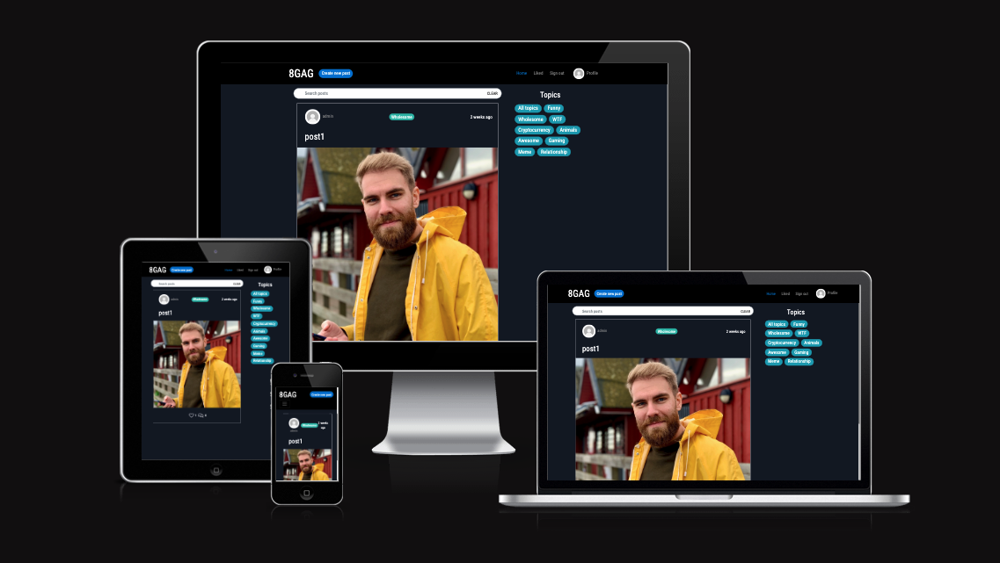
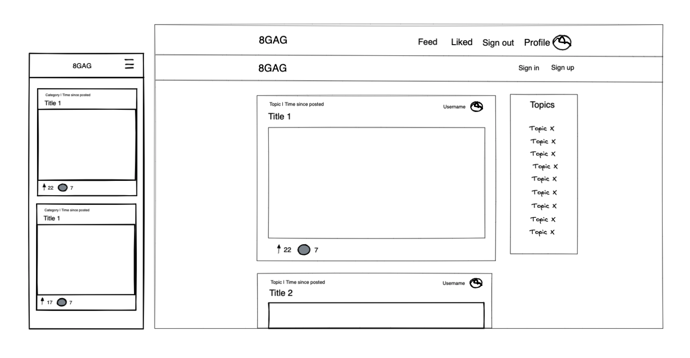
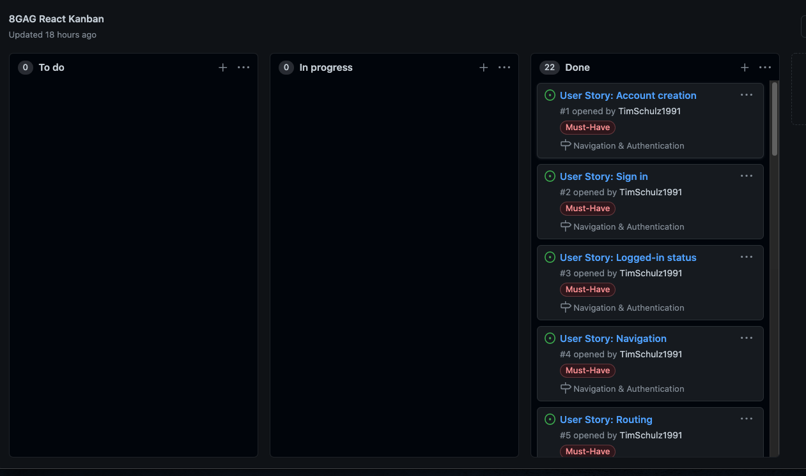
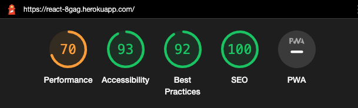

# 8GAG - Frontend React application [Live link](https://react-8gag.herokuapp.com/)

If you want to laugh and enjoy some good memes, you have come to the right place - to 8GAG!
Here, users have a place to post their best memes and laugh at, like and comment on other people's memes. The project was inspired by the popular meme website/app 9GAG. 

# Project Goals

The goal for this project was to build a meme sharing website, which includes all the basic functionality in order for potential visitors to start using the website in its intended way. These features include: 
- basic authentication/authorization functionality
- easy and clear navigation within the whole page
- full CRUD functionality regarding posts, comments and likes
- filtering capabilites; specifically for liked posts, for topics, and for title and author
- possibility to change profile information (bio text, image)

# User Experience

## EPICs --> User Stories

In the following section I will describe my EPICs for this project and the user stories derived from each EPIC. 

(MH - Must Have, SH - Should Have, CH - Could Have)

### 1. User authentication/authorisation & Navigation
- As a user I can create a new account so that I can access all the features for signed up users (MH)
- As a user I can sign in to the app so that I can access functionality for logged in users (MH)
- As a user I can tell if I am logged in or not so that I can log in if I need to (MH)
- As a user I can view a (conditionally rendering) navbar (based on logged-in status) from every page so that I can navigate easily between pages (MH)
- As a user I can navigate through pages quickly so that I can view content seamlessly without page refresh (MH)

### 2. Main Feed functionality
- As a user I can view all the most recent posts, ordered by most recently created first so that I am up to date with the newest content (MH)
- As a user, I can search for posts with keywords, so that I can find the posts and user profiles I am most interested in (MH)
- As a user, I can see the amount of likes/comments on each post in the feed, so I see what is popular right away and can check it out (MH)
- As a logged in user I can view the posts I liked so that I can find the memes I enjoyed the most (MH)
- As a logged in user, I can like/unlike a meme in the feed, to show or withdraw my appreciation for someone else's meme (MH)
- As a user, I can filter for certain meme categories, so that I can find the posts I am most interested in (SH)
- As a user, I can see who posted a meme and click on their profile, in order to see their profile page (SH)
- As a user I can keep scrolling through the memes on the site, that are loaded for me automatically so that I don't have to click on "next page" etc. (SH)

### 3. Adding a post
- As a logged in user I can create posts so that I can share my memes with the world! (MH)

### 4. Post page functionality
- As a user I can view the posts page so that I can read the comments about the post (MH)
- As a logged in post owner I can edit my post title and description so that I can make corrections or update my post after it was created, or delete it completely (MH)
- As a logged in user I can add comments to a post so that I can share my thoughts about the post (MH)
- As an owner of a comment I can edit my comment so that I can fix or update my existing comment or delete it entirely (MH)

### 5. Profile page functionality
- As a logged in user I can edit my profile so that I can change my profile picture and bio (MH)
- As a logged in user I can update my username and password so that I can change my display name and keep my profile secure (MH)
- As a user, I can see all the memes posted by a certain profile (either own profile or someone else), so that I can see all their memes in one place (MH)

In total, 18 user stories are a must-have and 3 are should-have. All of these have been worked on during a intense 2 week sprint in order to complete this project. 

# Design

## Color Scheme
The main colors used throughout the page are closely aligned to the dark colors of the 9GAG website (while browsing in dark mode). This makes the memes really "pop out" and puts them right into focus. 

- The navigation bar is kept in black while the page background is kept in a very dark blue 
- Other elements (buttons/badges) follow the Bootstrap color scheme 
- The page is using Bootstrap's blue for buttons and link hovering
- Turquoise buttons/badges are used to display/filter for topics

## Typography
A clean sans-serif font called 'Roboto Condensed', which is similar to the font used by 9GAG, has been used throughout the page in order to present the text in a clear, non-distracting way.

## Wireframes

The initially sketched wireframes of the page on desktop and mobile can be seen below. The final page ended up being very close to these mockups. Some elements were positioned in different places within the page. 

During the wireframing process I was gathering inspiration and ideas from the 9GAG website and made sure to implement its most important features and design elements.

# Frontend

## Developer Role

Frontend developers are mainly responsible for developing the user-facing side of web applications. Making sure the user is engaged and stays on the site is a primary objective. Responsiveness, accessibility, performance, interactivity and design all play a big factor in determining the success of an application, areas where frontend developers play a key role. As part of development teams, frontend developers primarily work with the UX/UI and backend teams, but UX/UI can also be part of a frontend developer's responsibilities. Despite being responsible for the frontend of an application, they need a good understanding of the underlying backend structure, in order to tie it into the frontend application in an appropriate manner.

## React

React is declarative JavaScript library. React allows building of independent, reusable UI components that can manage their own state to the DOM, pass values between other components as "props" and lifecycle methods to free up resources.

Relating to the project at hand, the component-based structure of React becomes evident. First of all, different components are used within one another, e.g. the Post component (showing a post and its details) has been used in the PostsPage component (the feed) and in the PostPage component (the page for each individual post).

Other components have been reused throughout the project as well, e.g. the Avatar component (showing the user avatar on each post and for the logged in user in the navbar), and the MoreDropdown component, to give users updating and deletion functionality for posts, comments and their profile information.

## React Bootstrap

React-Bootstrap is used for styling and responsiveness. Compared to regular Bootstrap, it comes as ready-to-use components for React. It is very popular and is one of the oldest libraries for React. This ensures compability and a vast selection of components and styles to build upon. React-Bootstrap is also built with accessibility in mind, an important factor when creating a frontend application. Since I have used Bootstrap for previous projects, it was an obvious choice to use it in this React project as well. 

# Agile

For this project the GitHub Kanban agile project management tool was used to create EPICs and add User Stories to these EPICs.
Furthermore, each user story was labelled with a must-have or should-have tag. All user stories have been finished throughout the project. 

Throughout the development process, the stories were constantly updated according to the progress and pushed into the right cloumn (in progress / done).

# Future Features Ideas / Improvements

Due to time constrains, these additional feature ideas could not be included in this project, but can be added in the future: 
- Delete user functionality
- Follow/unfollow other users and filter for the posts of only the people you follow
- Compressing the image size further before saving the image 

# API 

The backend API is built specifically for this frontend with the Django REST Framework. The repository for the DRF backend can be found [here](https://github.com/TimSchulz1991/project5-8GAG-DRF-API), the README [here](https://github.com/TimSchulz1991/project5-8GAG-DRF-API/blob/main/README.md) and the deployed API [here](https://drf-api-8gag.herokuapp.com/). The README describes the backend deployment process. 

# Technologies

## Languages

- [HTML](https://en.wikipedia.org/wiki/HTML5)
- [CSS](https://en.wikipedia.org/wiki/CSS)
- [JavaScript](https://www.w3schools.com/js/js_es6.asp)
  - [JSX](https://reactjs.org/)

## Programs, libraries, frameworks and dependencies

- [Gitpod](https://gitpod.io)
  - Gitpod to host a virtual workspace.
- [Git](https://git-scm.com/)
  - Git for version control by utilizing the Gitpod terminal to commit and push to GitHub and Heroku.
- [GitHub](https://github.com/)
  - GitHub to store the project code after being pushed from Git.
- [React 17](https://17.reactjs.org/)
  - React Router for dynamic routing.
- [Axios](https://axios-http.com/docs/intro)
  - Axios for promise-based HTTP.
- [React Router](https://v5.reactrouter.com/web/guides/quick-start)
  - React Router for dynamic routing.
- [JWT](https://jwt.io/)
  - JWT for tokens and timestamping tokens.
- [React-Bootstrap 1.6](https://react-bootstrap-v4.netlify.app/)
  - React-Bootstrap for styling and responsiveness.
- [Heroku](https://id.heroku.com/login)
  - Heroku to host both the frontend and backends applications and connect them.
- [Google Fonts](https://fonts.google.com/)
  - Google fonts for importing the Roboto Condensed font.
- [Font Awesome](https://fontawesome.com/)
  - Font Awesome for icons.
- [Excalidraw](https://excalidraw.com/) 
    - Used to create the wireframes during the design process.
- [ui.dev](https://ui.dev/amiresponsive) 
    - To test the responsiveness of the page.

# Testing

The W3C Markup Validator, W3C CSS Validator Services and ESLint were used to validate the code.

- [W3C Markup Validator](https://validator.w3.org/) shows no errors.
- [W3C CSS Validator](https://jigsaw.w3.org/css-validator/) shows no errors, except some neglectible errors in an imported Font Awesome css file.
- An [ESLint](https://eslint.org/) extension I used in my workspace shows no errors or warnings.

### Lighthouse

## Testing of implemented User Stories from User Experience (UX) section

### 1. User authentication/authorisation & Navigation
- As a user I can create a new account so that I can access all the features for signed up users (MH)
    - Works as intended.
- As a user I can sign in to the app so that I can access functionality for logged in users (MH)
    - XXX
- As a user I can tell if I am logged in or not so that I can log in if I need to (MH)
    - This can be easily seen within the navbar; if the user is logged in, the Profile avatar can be seen.
- As a user I can view a (conditionally rendering) navbar (based on logged-in status) from every page so that I can navigate easily between pages (MH)
    - Works as intended.
- As a user I can navigate through pages quickly so that I can view content seamlessly without page refresh (MH)
    - Works as intended; there is only a complete refresh of the page when clicking on the navbar brand.

### 2. Main Feed functionality
- As a user I can view all the most recent posts, ordered by most recently created first so that I am up to date with the newest content (MH)
    - Works as intended.
- As a user, I can search for posts with keywords, so that I can find the posts and user profiles I am most interested in (MH)
    - Works as intended.
- As a user, I can see the amount of likes/comments on each post in the feed, so I see what is popular right away and can check it out (MH)
    - Works as intended.
- As a logged in user I can view the posts I liked so that I can find the memes I enjoyed the most (MH)
    - Works as intended.
- As a logged in user, I can like/unlike a meme in the feed, to show or withdraw my appreciation for someone else's meme (MH)
    - Works as intended.
- As a user, I can filter for certain meme categories, so that I can find the posts I am most interested in (SH)
    - Works as intended.
- As a user, I can see who posted a meme and click on their profile, in order to see their profile page (SH)
    - Works as intended.
- As a user I can keep scrolling through the memes on the site, that are loaded for me automatically so that I don't have to click on "next page" etc. (SH)
    - Works as intended.

### 3. Adding a post
- As a logged in user I can create posts so that I can share my memes with the world! (MH)
    - Works as intended.

### 4. Post page functionality
- As a user I can view the posts page so that I can read the comments about the post (MH)
    - Works as intended.
- As a logged in post owner I can edit my post title and description so that I can make corrections or update my post after it was created, or delete it completely (MH)
    - Works as intended.
- As a logged in user I can add comments to a post so that I can share my thoughts about the post (MH)
    - Works as intended.
- As an owner of a comment I can edit my comment so that I can fix or update my existing comment or delete it entirely (MH)
    - Works as intended.

### 5. Profile page functionality
- As a logged in user I can edit my profile so that I can change my profile picture and bio (MH)
    - Works as intended.
- As a logged in user I can update my username and password so that I can change my display name and keep my profile secure (MH)
    - Works as intended.
- As a user, I can see all the memes posted by a certain profile (either own profile or someone else), so that I can see all their memes in one place (MH)
    - Works as intended.

## Manual Testing

### Navigation

| Test               | Action                                       | Expected Result                                                                                                                   | Pass |
| ------------------ | -------------------------------------------- | --------------------------------------------------------------------------------------------------------------------------------- | ---- |
| Site logo          | Click logo                                   | Take the user to the home page.                                                                                                   | ✓    |
| Sign in navbar      | Click "Sign in" link                          | Take the user to the sign in page.                                                                                                 | ✓    |
| Sign in page        | Click "Log in" button                        | If user logs in successfully, redirect to home.                                                                                                | ✓    |
| Sign in page        | Click "Sign up" link                         | Take the user to the sign up page.                                                                                                | ✓    |
| Sign up navbar     | Click "Sign up" link                         | Take the user to the sign up page.                                                                                                | ✓    |
| Sign up page       | Click "Sign up" button                       | If user signs up successfully, redirect to log in page.                                                                                        | ✓    |
| Sign up page       | Click "Log in" link                          | Take the user to the log in page.                                                                                                 | ✓    |
| Sign up/log in     | Enter URL for sign up/log in while logged in | Redirects user to home page.                                                                                                      | ✓    |
| Log out navbar     | Click "Log out" link                         | Log out user and redirect to home page.                                                                                           | ✓    |
| Create post navbar | Click "Create new post" button                           | When logged in, takes the user to the create post page.                                                                           | ✓    |
| Create post page   | Click "Create" button                        | If user creates post successfully, redirect to this post.                                                                                      | ✓    |
| "Home" in navbar | Click "Home" link                            | Render list of all posts, sorted by latest first.                                                                           | ✓    |
| Post "Liked"       | Click "Liked" link                           | Render list of posts the user has liked.                                                                                          | ✓    |
| Profile navbar     | Click profile image or on "Profile" link                  | Take user to user's profile page                                                                                                  | ✓    |
| Profile on Post  | Click profile image or name                  | Take user to the clicked user's profile page.                                                                                     | ✓    |
| Edit post (when owner)          | Click edit icon in dropdown                  | Take user to edit post page.                                                                                                      | ✓    |
| Edit post page     | Click "Save" button                          | Take user to newly edited post.                                                                                                   | ✓    |
| Edit post page     | Click "Cancel" button                        | Take user back to the post.                                                                                                       | ✓    |
| Delete post        | Click delete icon in dropdown                | Delete post and take user to previous page.                                                                                       | ✓    |
| Infinite scroll    | Scrolling to end of page                     | Render new posts and/or comments if there's more than 10 of any.                                                                  | ✓    |
| Unauthorized       | Visit page unauthorized                      | Reaching a create, edit or delete page through URL manipulation to content the user is not authorized for, redirect to home page. | ✓    |
